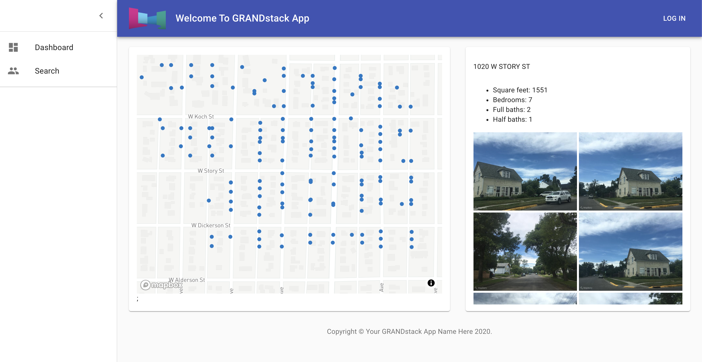
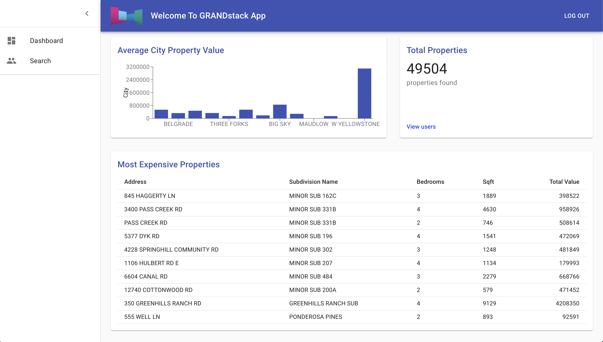
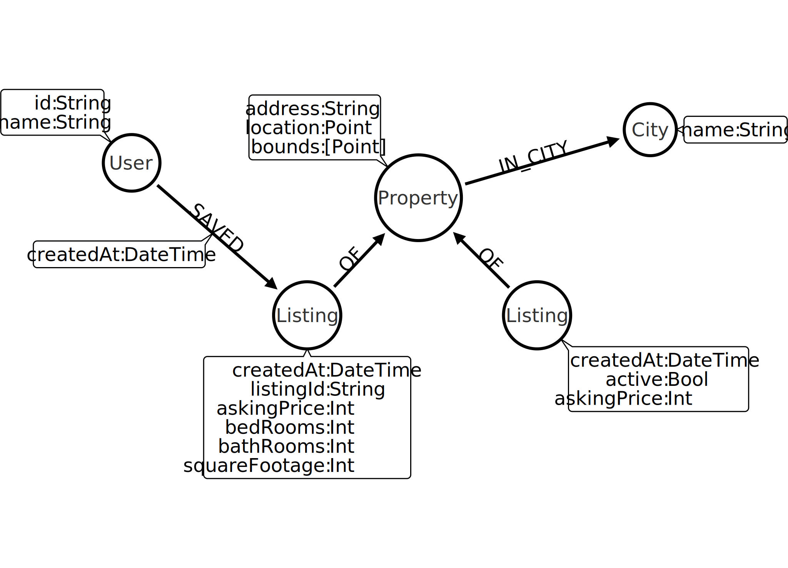

[](https://grandstack.io/deploy-starter-netlify) [](https://grandstack.io/deploy-starter-vercel) [](https://sandbox.neo4j.com/?usecase=blank-sandbox)

# Willow

A real estate search application built using GRANDstack: GraphQL, React, Apollo, and Neo4j Database while being livestreamed! Check out the [YouTube Playlist](https://www.youtube.com/playlist?list=PL9Hl4pk2FsvV_ojblDzXCg6gxdv437PGg) to catch up on all the videos or select from the list below:

- Part 1: [Getting Started With Neo4j GraphQL & Netlify](https://www.youtube.com/watch?v=i6X6oKJjx3g&list=PL9Hl4pk2FsvV_ojblDzXCg6gxdv437PGg&index=7)
- Part 2: [Data Modeling & Import](https://www.youtube.com/watch?v=WB--CkjKJMQ&list=PL9Hl4pk2FsvV_ojblDzXCg6gxdv437PGg&index=8)
- Part 3: [Geospatial Data With GraphQL](https://www.youtube.com/watch?v=_60Kf0SnuWQ&list=PL9Hl4pk2FsvV_ojblDzXCg6gxdv437PGg&index=3)
- Part 4: [More Geospatial GraphQL & Low Code GraphQL w/ GraphQL Architect](https://www.youtube.com/watch?v=Hly-jmH8LHo&list=PL9Hl4pk2FsvV_ojblDzXCg6gxdv437PGg&index=9)
- Part 5: [Apollo React Hooks & Deploying To Aura](https://www.youtube.com/watch?v=89ShDNwfVj8&list=PL9Hl4pk2FsvV_ojblDzXCg6gxdv437PGg&index=5)
- Part 6: [Adding A Map View & Search Results](https://www.youtube.com/watch?v=juv8IOLLNnQ&list=PL9Hl4pk2FsvV_ojblDzXCg6gxdv437PGg&index=10)
- Part 7: [Custom Resolver In Neo4j GraphQL & Photos From the Mapillary API](https://www.youtube.com/watch?v=IQ05VQxFcK0&list=PL9Hl4pk2FsvV_ojblDzXCg6gxdv437PGg&index=4)
- [Exploring Authorization With GraphQL & GRANDstack](https://www.youtube.com/watch?v=0SHl5v7FT_I&list=PL9Hl4pk2FsvV_ojblDzXCg6gxdv437PGg&index=25)
- Part 8: [GraphQL Authorization With Auth0](https://www.youtube.com/watch?v=Ay7-RyX9XPM&list=PL9Hl4pk2FsvV_ojblDzXCg6gxdv437PGg&index=4)
- Part 9: [Adding A Saved Properties Feature](https://www.youtube.com/watch?v=QRSwDJAkuHw&list=PL9Hl4pk2FsvV_ojblDzXCg6gxdv437PGg&index=27)
- Part 10: [GraphQL Mutations & Authorization With Auth0](https://www.youtube.com/watch?v=dCCObITlSY0&list=PL9Hl4pk2FsvV_ojblDzXCg6gxdv437PGg&index=28)

## Functionality

**Search View**



**Dashboard View**



## Architecture


## Data Model

<details>
  <summary>Arrows markup</summary>
  
  Markup for defining data model using the [Arrows graph diagraming tool](http://www.apcjones.com/arrows/)

```html
<ul
  class="graph-diagram-markup"
  data-internal-scale="1"
  data-external-scale="1"
>
  <li
    class="node"
    data-node-id="0"
    data-x="-1713.637451171875"
    data-y="317.54315185546875"
  >
    <span class="caption">User</span>
    <dl class="properties">
      <dt>id</dt>
      <dd>String</dd>
      <dt>name</dt>
      <dd>String</dd>
    </dl>
  </li>
  <li
    class="node"
    data-node-id="1"
    data-x="-729.3491363525391"
    data-y="1243.0390625"
  >
    <span class="caption">Listing</span>
    <dl class="properties">
      <dt>createdAt</dt>
      <dd>DateTime</dd>
      <dt>listingId</dt>
      <dd>String</dd>
      <dt>askingPrice</dt>
      <dd>Int</dd>
      <dt>bedRooms</dt>
      <dd>Int</dd>
      <dt>bathRooms</dt>
      <dd>Int</dd>
      <dt>squareFootage</dt>
      <dd>Int</dd>
    </dl>
  </li>
  <li
    class="node"
    data-node-id="2"
    data-x="1083.0440673828125"
    data-y="-459.44090270996094"
  >
    <span class="caption">City</span>
    <dl class="properties">
      <dt>name</dt>
      <dd>String</dd>
    </dl>
  </li>
  <li
    class="node"
    data-node-id="3"
    data-x="28.259565114974976"
    data-y="458.7174263000488"
  >
    <span class="caption">Property</span>
    <dl class="properties">
      <dt>id</dt>
      <dd>String</dd>
      <dt>address</dt>
      <dd>String</dd>
      <dt>location</dt>
      <dd>Point</dd>
      <dt>bounds</dt>
      <dd>[Point]</dd>
    </dl>
  </li>
  <li
    class="node"
    data-node-id="4"
    data-x="1409.7587890625"
    data-y="554.8055877685547"
  >
    <span class="caption">Listing</span>
    <dl class="properties">
      <dt>createdAt</dt>
      <dd>DateTime</dd>
      <dt>active</dt>
      <dd>Bool</dd>
      <dt>askingPrice</dt>
      <dd>Int</dd>
    </dl>
  </li>
  <li
    class="node"
    data-node-id="5"
    data-x="252.71633911132812"
    data-y="-393.4471435546875"
  >
    <span class="caption">Neighborhood</span>
    <dl class="properties">
      <dt>name</dt>
      <dd>String</dd>
    </dl>
  </li>
  <li
    class="node"
    data-node-id="6"
    data-x="-729.3491363525391"
    data-y="-348.6604309082031"
  >
    <span class="caption">Subdivision</span>
    <dl class="properties">
      <dt>name</dt>
      <dd>String</dd>
    </dl>
  </li>
  <li
    class="node"
    data-node-id="7"
    data-x="682.1227416992188"
    data-y="1032.9970703125"
  >
    <span class="caption">Appraisal</span>
    <dl class="properties">
      <dt>property_id</dt>
      <dd>String,</dd>
      <dt>year</dt>
      <dd>Int,</dd>
      <dt>land</dt>
      <dd>Int,</dd>
      <dt>building</dt>
      <dd>Int,</dd>
      <dt>total</dt>
      <dd>Int,</dd>
      <dt>method</dt>
      <dd>String</dd>
    </dl>
  </li>
  <li
    class="node"
    data-node-id="8"
    data-x="28.259565114974976"
    data-y="1112.759033203125"
  >
    <span class="caption">Appraisal</span>
    <dl class="properties">
      <dt>property_id</dt>
      <dd>String,</dd>
      <dt>year</dt>
      <dd>Int,</dd>
      <dt>land</dt>
      <dd>Int,</dd>
      <dt>building</dt>
      <dd>Int,</dd>
      <dt>total</dt>
      <dd>Int,</dd>
      <dt>method</dt>
      <dd>String</dd>
    </dl>
  </li>
  <li class="relationship" data-from="0" data-to="1">
    <span class="type">SAVED</span>
    <dl class="properties">
      <dt>createdAt</dt>
      <dd>DateTime</dd>
    </dl>
  </li>
  <li class="relationship" data-from="1" data-to="3">
    <span class="type">OF</span>
  </li>
  <li class="relationship" data-from="4" data-to="3">
    <span class="type">OF</span>
  </li>
  <li class="relationship" data-from="3" data-to="2">
    <span class="type">IN_CITY</span>
  </li>
  <li class="relationship" data-from="3" data-to="5">
    <span class="type">:IN_NEIGHBORHOOD</span>
  </li>
  <li class="relationship" data-from="3" data-to="6">
    <span class="type">:IN_SUBDIVISION</span>
  </li>
  <li class="relationship" data-from="3" data-to="7">
    <span class="type">HAS_APPRAISAL</span>
  </li>
  <li class="relationship" data-from="3" data-to="8">
    <span class="type">HAS_APPRAISAL</span>
  </li>
</ul>
```

</details>



## Requirements

- As a user I want to search for properties for sale by city so that I can view property details.

```cypher
MATCH (l:Listing)-[:OF]-(p:Property)-[:IN]->(c:City)
WHERE c.name = "San Mateo"
```

- As a user I want to limit my search to properties with certain attributes or range of attributes so that I can narrow the results to those relevant to me.
- As a user searching for properties I want to view property details so I can learn more about the listing.

## GRANDstack Starter

This project was created using the GRANDstack Starter.

```
npx create-grandstack-app myNewApp
```

This project is a starter for building a [GRANDstack](https://grandstack.io) (GraphQL, React, Apollo, Neo4j Database) application. There are two components to the starter, the web frontend application (in React and Angular flavors) and the API app (GraphQL server).

[](http://www.youtube.com/watch?v=1JLs166lPcA 'Hands On With The GRANDstack Starter')

_Hands On With The GRANDstack Starter Video_

## Quickstart

The easiest way to get started with the GRANDstack Starter is to create a Neo4j Sandbox instance and use the `create-grandstack-app` command line tool.

### 1. Create A Neo4j Sandbox Instance

[Neo4j Sandbox](https://neo4j.com/sandbox) allows you to create a free hosted Neo4j instance private to you that can be used for development.

After singing in to Neo4j Sandbox, click the `+ New Project` button and select the "Blank Sandbox" option. In the next step we'll use the connection credentials from the "Connection details" tab to connect our GraphQL API to this Neo4j instance.


### 2. Run the `create-grandstack-app` CLI

```
npx create-grandstack-app myNewApp
```

or with Yarn

```
yarn create grandstack-app myNewApp
```


This will create a new directory `myNewApp`, download the latest release of the GRANDstack Starter, install dependencies and prompt for your connection credentials for Neo4j to connect to the GraphQL API.

### 3. Seed the database (optional)

Once the application is running, in another terminal run

```
npm run seedDb
```

or with Yarn

```
yarn run seedDb
```

### 4. Open In Browser


## Overview

The GRANDstack Starter is a monorepo that includes a GraphQL API application and client web applications for React (default) and Angular.

### `/` - Project Root

The root directory contains some global configuration and scripts:

- `npm run start` and `npm run build`
- ESLint (.eslintrc.json) for code linting
- Prettier (.prettierrc.json) for code formatting
- Git hooks for applying formatting on commit

### [`/api`](./api)


This directory contains the GraphQL API application using Apollo Server and neo4j-graphql.js.

- Change environment variable settings in `.env`:

```
# Use this file to set environment variables with credentials and configuration options
# This file is provided as an example and should be replaced with your own values
# You probably don't want to check this into version control!

NEO4J_URI=bolt://localhost:7687
NEO4J_USER=neo4j
NEO4J_PASSWORD=letmein

# Uncomment this line to enable encrypted driver connection for Neo4j
#NEO4J_ENCRYPTED=true

# Uncomment this line to specify a specific Neo4j database (v4.x+ only)
#NEO4J_DATABASE=neo4j

GRAPHQL_SERVER_HOST=0.0.0.0
GRAPHQL_SERVER_PORT=4001
GRAPHQL_SERVER_PATH=/graphql

```

### [`/web-react`](./web-react)


The frontend React web application is found in this directory.

It includes:

- Material UI
- React router
- Apollo Client / React Hooks
- Create React App

### [`/web-angular`](./web-angular)


A UI built with [Angular](https://angular.io), [Apollo](https://www.apollographql.com/docs/angular/) and the [Clarity Design System](https://clarity.design) is also available.

_Start the Angular UI server_

```
cd ./web-angular && npm start
```

See [the project releases](https://github.com/grand-stack/grand-stack-starter/releases) for the changelog.

## Deployment

### Netlify

This monorepo can be deployed to Netlify. The frontend application will be served over Netlify's CDN and the GraphQL API will be provisioned as a serverless GraphQL API lambda function deployed to AWS (via Netlify). A netlify.toml file is included with the necessary build configurations. The following environment variables must be set in Netlify (either via the Netlify web UI or via the command line tool)

```
NEO4J_URI
NEO4J_USER
NEO4J_PASSWORD
```

See the "Hands On With The GRANDStack Starter" video linked at the beginning of this README for a walkthrough of deploying to Netlify.

### Vercel / Zeit Now

Zeit Now v2 can be used with monorepos such as grand-stack-starter. [`now.json`](https://github.com/grand-stack/grand-stack-starter/blob/master/now.json) defines the configuration for deploying with Zeit Now v2.

1. Set the now secrets for your Neo4j instance:

```
now secret add grand_stack_starter_neo4j_uri bolt://<YOUR_NEO4J_INSTANCE_HERE>
now secret add grand_stack_starter_neo4j_user <YOUR_DATABASE_USERNAME_HERE>
now secret add grand_stack_starter_neo4j_password <YOUR_DATABASE_USER_PASSWORD_HERE>
```

2. Run `now`

## Docker Compose

You can quickly start via:

```
docker-compose up -d
```

If you want to load the example DB after the services have been started:

```
docker-compose run api npm run seedDb
```

You can find instructions for other ways to use Neo4j (Neo4j Desktop, Neo4j Aura, and other cloud services) in the [Neo4j directory README.](./neo4j)

This project is licensed under the Apache License v2.
Copyright (c) 2020 Neo4j, Inc.
